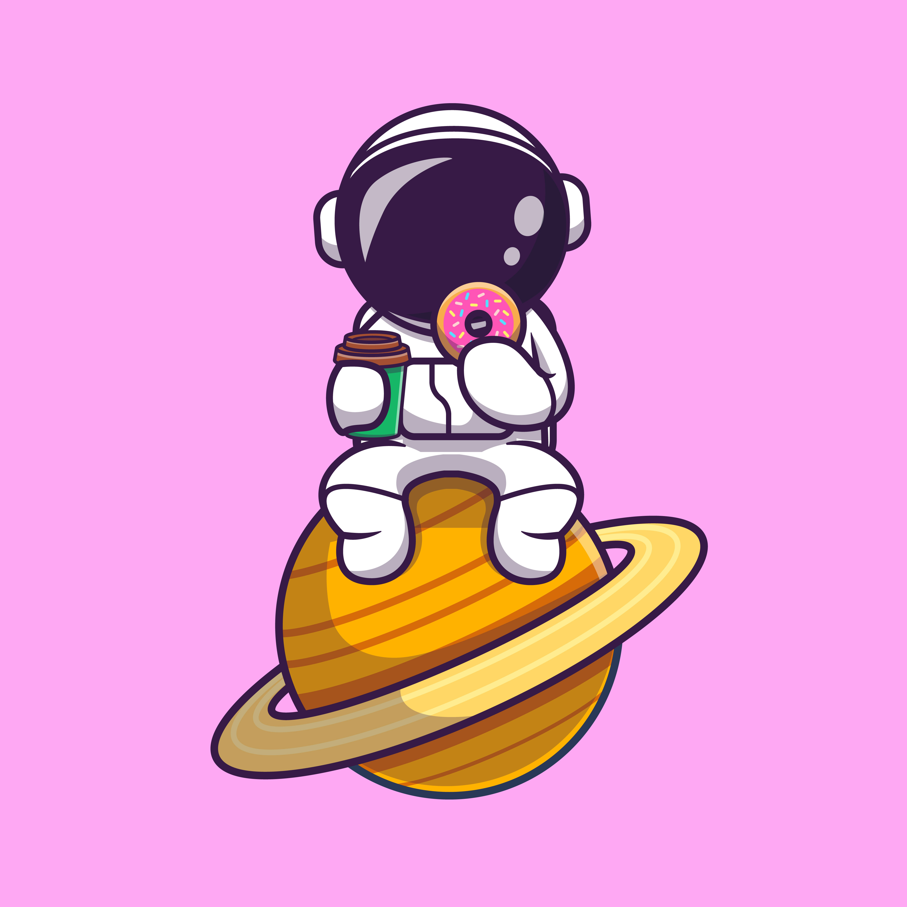

# Ander Lakidain - Software Engineer

   
  
   

[Personal website](https://lakidain.github.io/) where you can find my resume and my contact info.

Astronaut images are created by [Catalystuff](https://www.freepik.com/catalyststuff) shared on [Freepik](https://www.freepik.com) for free ❤️.

Faviton designed by [Freepik](https://www.flaticon.com/authors/freepik) published on [https://www.flaticon.com](Flaticon).

Find me following links below! 🚀

&nbsp;&nbsp;
&nbsp;&nbsp;

